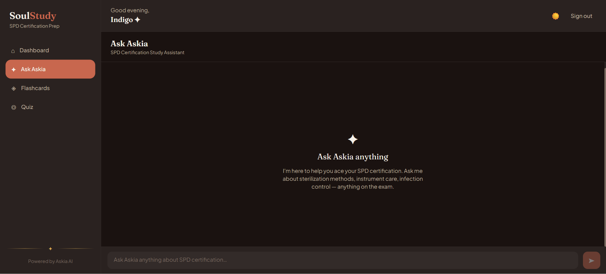
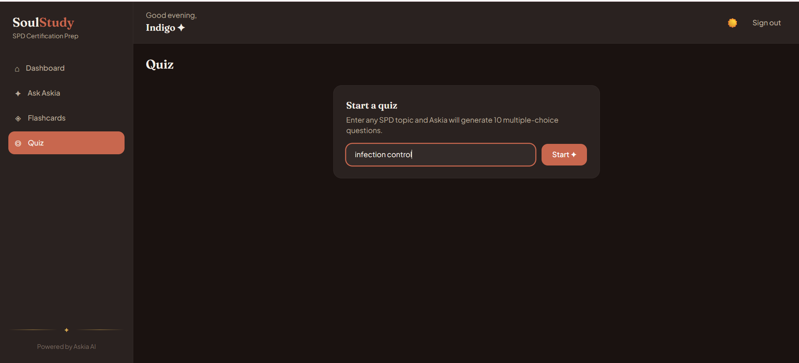
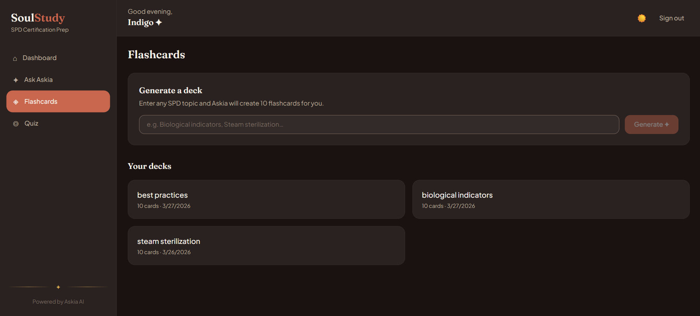

# SoulStudy


[](https://soulstudy.vercel.app)

AI-powered study companion for Sterile Processing Technician (SPD) certification prep. Built with Next.js and powered by Claude — featuring streaming chat with Askia (your AI study guide), flashcard decks, adaptive quizzes, and a personal dashboard that tracks your progress.

## Screenshots

| Dashboard | Chat with Askia |
|---|---|
|  |  |

| Quiz | Flashcards |
|---|---|
|  |  |

## Tech Stack

| Layer | Technology |
|---|---|
| Framework | Next.js 16 (App Router) |
| Language | TypeScript (strict) |
| Styling | Tailwind CSS v4 + CSS custom properties |
| Auth & Database | Firebase Authentication + Firestore |
| AI | Anthropic Claude (`claude-sonnet-4-6`) |
| Testing | Vitest + React Testing Library |
| Deploy | Vercel |

## Prerequisites

- Node.js 20+
- A Firebase project (Authentication + Firestore enabled)
- An Anthropic API key

## Getting Started

```bash
# 1. Clone the repo
git clone <repo-url>
cd soulstudy

# 2. Install dependencies
npm install

# 3. Set up environment variables
cp .env.example .env.local
# Fill in your Firebase and Anthropic credentials (see Environment Variables below)

# 4. Run the dev server
npm run dev
```

Open [http://localhost:3000](http://localhost:3000).

## Project Structure

```
soulstudy/
├── app/
│   ├── (auth)/          # Login and signup pages
│   ├── (dashboard)/     # Protected dashboard layout + pages
│   │   └── dashboard/   # Main dashboard (stats, quiz history)
│   │   └── chat/        # Streaming chat with Askia
│   │   └── flashcards/  # Flashcard deck builder and study mode
│   │   └── quiz/        # Quiz generator and results
│   └── api/             # Route handlers (chat stream, quiz, flashcards)
├── components/
│   ├── chat/            # ChatInput, MessageBubble, StreamingIndicator
│   ├── flashcards/      # FlashcardDeck, FlashcardFlip
│   ├── layout/          # Header, Sidebar, MobileNav
│   ├── quiz/            # QuizQuestion, QuizResults
│   └── ui/              # Button, Card, Spinner (shared primitives)
├── hooks/               # useAuth, useChat, useDashboard, useFlashcards, useQuiz, useTheme
├── lib/
│   ├── integrations/    # Firebase and Anthropic SDK clients
│   ├── models/          # TypeScript types and Zod schemas
│   ├── prompts/         # Askia system prompt
│   ├── repositories/    # All Firestore queries
│   ├── services/        # Business logic (quiz, flashcard, chat)
│   └── utils/           # Pure helper functions
└── docs/
    └── planning/        # Implementation plan and sprint tracking
```

## Available Scripts

| Command | Description |
|---|---|
| `npm run dev` | Start local dev server at localhost:3000 |
| `npm run build` | Production build |
| `npm start` | Run production build locally |
| `npm run lint` | ESLint check |
| `npm test` | Run test suite (Vitest) |
| `npm run test:watch` | Run tests in watch mode |

## Environment Variables

Copy `.env.example` to `.env.local` and fill in the values.

| Variable | Description |
|---|---|
| `ANTHROPIC_API_KEY` | Anthropic API key — server-side only |
| `NEXT_PUBLIC_FIREBASE_API_KEY` | Firebase project API key |
| `NEXT_PUBLIC_FIREBASE_AUTH_DOMAIN` | Firebase auth domain |
| `NEXT_PUBLIC_FIREBASE_PROJECT_ID` | Firebase project ID |
| `NEXT_PUBLIC_FIREBASE_STORAGE_BUCKET` | Firebase storage bucket |
| `NEXT_PUBLIC_FIREBASE_MESSAGING_SENDER_ID` | Firebase messaging sender ID |
| `NEXT_PUBLIC_FIREBASE_APP_ID` | Firebase app ID |

> `NEXT_PUBLIC_` variables are exposed to the browser. `ANTHROPIC_API_KEY` is server-side only and must never be prefixed with `NEXT_PUBLIC_`.

## Docker

```bash
# Build the image
docker build -t soulstudy .

# Run the container (pass env vars inline or via --env-file)
docker run -p 3000:3000 \
  -e ANTHROPIC_API_KEY=sk-ant-... \
  -e NEXT_PUBLIC_FIREBASE_API_KEY=... \
  soulstudy
```

The Dockerfile uses a three-stage build: `deps` → `builder` → `runner` (Alpine-based, non-root user, Next.js standalone output).

## Live Demo

[https://soulstudy.vercel.app](https://soulstudy.vercel.app)

## Deployment (Vercel)

1. Push the repo to GitHub
2. Import the project at [vercel.com/new](https://vercel.com/new)
3. Add all environment variables from `.env.example` in the Vercel dashboard
4. Deploy — Vercel auto-detects Next.js, no build config needed

## Architecture

```
app/api/ (route handlers)
    ↓
lib/services/       ← business logic
    ↓
lib/repositories/   ← Firestore queries
    ↓
Firebase Firestore

lib/services/
    ↓
lib/integrations/anthropic.ts → Anthropic API (streaming)
```

Route handlers are thin — they validate input, call a service, and stream or return the response. No business logic lives in `app/api/`.
